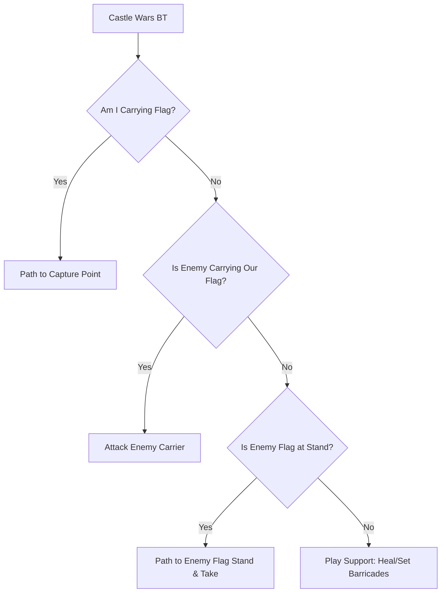

# Progressive Bot System Spec: Minigames & World Events

This document details the architectural design and behavior trees required to support bot participation in minigames (e.g. Castle Wars, Pest Control, Barrows) and dynamic server-wide events.

---

## 1. Minigame Integration Design

Minigames require cooperative play, puzzle solving, and objective-oriented pathfinding. Rather than playing randomly, bots utilize specialized Behavior Trees that prioritize objectives based on the current state of the match.

### 1.1 Objective-Based Decisions (Castle Wars Example)
Castle Wars is modeled as a composite of offensive, defensive, and support trees:



### 1.2 Object & NPC Interactives (Pest Control Example)
In Pest Control, bots focus on shielding the Void Knight and destroying portals:
1. **Defend Void Knight**: If Void Knight HP is < 40%, switch target to nearby pests.
2. **Portal Attack**: Scan regional NPCs for active portals. If a portal's shield drops, route-request to the portal and engage in combat.
3. **Barricades & Gates**: Use `GateSweeperDecorator` to open/close gates to control pest flow.

---

## 2. World Events & Circumstances

World events (e.g., Wilderness bosses, town invasions, holiday events) are broadcast to the bot ecosystem via a server event listener:

### 2.1 Event Broker & Utility Selection
When a world event starts, an event notification is published:
```kotlin
class WorldEventStarted(val eventType: String, val coords: CoordGrid, val npcId: Int)
```

1. `BotManager` listens for `WorldEventStarted`.
2. It flags the event in the bots' global context.
3. In `BotPersonality.kt`, the utility score for `ParticipateInEvent` is set:
   * **Casual Bots**: 80% chance to join if within 100 tiles.
   * **Fighter/Balanced Bots**: 100% chance to join, preparing combat gear.
   * **Skiller Bots**: Ignore the event and continue skilling.

### 2.2 Event Pathing & Collaboration
Once selected, the bot:
1. Paths to the event coordinate.
2. Evaluates the target NPC (boss).
3. Executes a collaborative combat loop (e.g. auto-attacking, eating food if HP drops, dodging area attacks if the coordinate is flagged).
