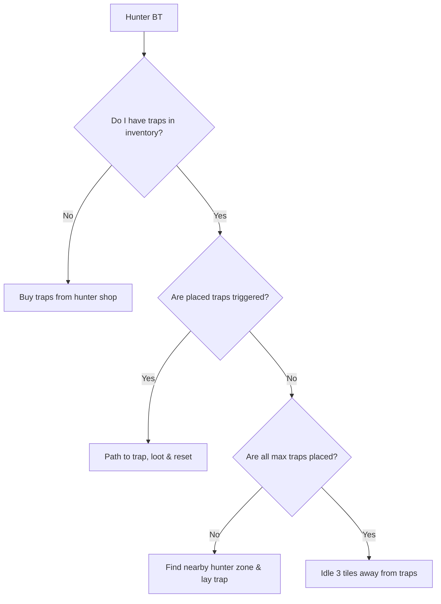

# Progressive Bot System Spec: Quest Graphs & Complex Skills

This document details the architectural design and behavior trees required to support bot questing automation, along with advanced mechanics for complex OSRS skills: **Hunter**, **Construction**, and **Sailing**.

---

## 1. Advanced Questing Automation

OSRS quests are state-machines tracked on the server via player variables (Varp/Varbit). A bot must traverse this state-space by executing sequential node chains.

```
       [Quest Selector Node]
                 │
                 ▼ (Checks Quest Points & Skill Prereqs)
        [Active Quest Graph]
                 │
                 ▼ (Inspects current Varp/Varbit progress value)
        [Current Step Node]
                 │
      ┌──────────┼──────────┐
      ▼          ▼          ▼
[Item Gather] [NPC Dialogue] [Combat Target]
```

### 1.1 Dialogue Injection State Machine
NPC dialogues are interactive sequences of chat packets, continue prompts, and choice selections. Bots automate this through a **Dialogue Sequence Runner**:
1. Intercept the `MapReceiver.DialogueOpen` package.
2. Maintain a `dialog_option_sequence` stack (e.g. `listOf(1, 2)` represents: choice 1 on first prompt, choice 2 on second prompt).
3. On tick, if a dialog prompt is open:
   * If it is a "Click here to continue" prompt: Send the `ResumePauseButton` packet.
   * If it is a choice selection: Send the `ResumePauseButton` packet with the index matching the top option of the stack.

---

## 2. Hunter Skill Loop (Trap-Based Logic)

Unlike static trees/rocks, Hunter requires managing dynamic entity state-machines (Traps) across two main brackets: Bird Snaring and Box Trapping.

### 2.1 Trap State Machine
Each trap placed by a bot is stored in its `spatialMemory` and tracked through five states:
1. `PLACED`: Trap is active. Bot stands back to avoid scaring prey.
2. `TRIGGERED_SUCCESS`: Prey is caught. Bot paths to coordinate and loots.
3. `TRIGGERED_FAILED`: Trap collapsed empty. Bot paths to coordinate and dismantles/picks up.
4. `DECAYED`: Trap left unattended too long. Dismantled back to item form on floor.
5. `INTERRUPTED`: Another player dismantled or took the trap coordinates.

### 2.2 Hunter Behavior Tree


---

## 3. Construction Skill Loop (POH Instancing)

Construction is performed inside private Player Owned House (POH) instances. Bots must navigate building modes, interface structures, and inventory material pipelines.

### 3.1 POH Build Loop
1. **Enter House**: Path to portal, select "Enter House (Building Mode)".
2. **Scan Hotspots**: Inspect the surrounding zone for available build spaces (e.g. "Larder Space", "Chair Space") using `LocRegistry`.
3. **Build Action**:
   * Send interaction packet `InteractionLocOp(option=1)` on the hotspot.
   * The server sends a building interface (`id: 396`).
   * Intercept interface configuration and send button-click packet corresponding to the target object (e.g., Oak Larder requires 8 Oak Planks).
4. **Remove Action (XP Farming)**:
   * Interact with the newly built object, selecting the "Remove" option.
   * Confirm prompt via dialogue injection, then repeat the Build Action.

### 3.2 Material Management (Butler Loop)
* Bots check inventory for planks. If planks are exhausted and planks remain in the bank:
  * Interact with the Butler NPC inside the house.
  * Send dialogue option: "Go fetch [X] planks from the bank."
  * Wait until Butler returns before resuming the build loop.

---

## 4. Sailing Skill Loop (Vehicle Pathfinding & Wind Vectors)

Sailing involves moving a vehicle (ship) across open sea nodes, navigating wind directions, and managing crew/stations.

### 4.1 Wind Vector Navigation
Ships move faster when sailing *with* the wind. Bots evaluate pathfinding directions against global wind vectors:
* **Tacking**: If sailing directly into the wind (dead angle), the bot schedules a zig-zag path (tacking) to maintain speed.
* **Wind Ticks**: Check wind direction change events. Readjust sails (Interact with mast/rigging locs) to align with new vectors.

### 4.2 Obstacle & Port Pathfinding
* **Sea Pathfinding**: The movement loop is modified to bypass solid water obstacles (reefs, whirlpools, islands).
* **Port Transitions**: Entering a port triggers a docking transition. Bots select the docking loc, wait for transition animations, and automatically exit the ship instance onto land.
