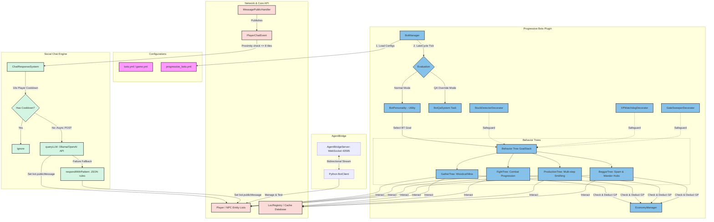

# OpenRune Progressive Bots: System Architecture & Integration Summary

This document provides a birds-eye view of how the Progressive Bots system, the Economy Engine, the Proximity Social Chat system, the QA Override system, and the external AgentBridge connect together to form a living, interactive server ecosystem.

---

## 1. System Architecture Diagram

The diagram below illustrates the relationship between the server modules, the network layer, our behavior engine, and the external AI client layers:

---

## 2. Subsystem Integrations

### 2.1 Game-AI & Economy Integration
* **Skilling Flow**: Bots grind resources and walk to regional trade hubs (GE, Lumbridge/Varrock general stores).
* **GP Conversions**: `EconomyManager` converts logs/ores/bars into GP based on standard cache values, allowing bots to buy tools or weapons required for the next level tier.
* **Low GP Fallbacks**: If the bot does not have enough GP to purchase upgrades, they enter a temporary beggar/scammer state to ask for coins, or switch to combat goals to farm GP drops from goblins.

### 2.2 Proximity Chat & LLM Loop
* **Interactive Spawning**: When human players enter active hubs, bots converse naturally.
* **Non-blocking Request Handling**: The main tick thread is protected. WebSocket/HTTP queries to LLM servers run in background threads, falling back instantly to pattern-matching if the endpoint times out.

### 3. QA Testing Pipeline
* **Command Override**: Developers can execute `::botqa <bot> <task>` to take control of any bot.
* **External Websocket Controls**: Through the `AgentBridge`, external agents (like Python scripts or Hermes) can bypass default behaviors, tele-jump, spawn test items, perform actions, and monitor tick-by-tick state changes to assertions.
